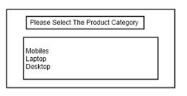

# E-Commerce_bot
 
<br />
<p align="center">
  
  <h1 align="center">E-Commerce_bot online shoping</h1>
  <p align="center">
    This bot has been created using [Bot Framework](https://dev.botframework.com), it shows how to create a simple bot that accepts input from the user and echoes it back.
  </p>
</p>
 

      
We developed this project to ease shopping using teams. 
These bot can be used to avoid extra account to manage for shopping website.  

E-commerce uses backend data base  to generate order or manage order and profile of user and admin.
In order to generate a order we select product against common data like:

1. Profile &ensp;&ensp;&ensp;&ensp;&ensp;&ensp;&ensp;&ensp;&ensp;&ensp;&ensp;&ensp;&ensp;&ensp;
2. Cart &ensp;&ensp;&ensp;&ensp;&ensp;&ensp;&ensp;&ensp;&ensp;&ensp;&ensp;&ensp;&ensp;&ensp; 
3. Home &ensp;&ensp;&ensp;&ensp;&ensp;&ensp;&ensp;&ensp;&ensp;&ensp;&ensp;&ensp;&ensp;&ensp;&ensp;&ensp;&ensp; 
4. Shopping product page  
5. Payment page  
6. orders page  
7. Login/Signup pages  

Once we have update database the product list shown in product pages and also we can update in database for add new product or change the quantity or price.  


If you want to know more about the project then checkout [E-commerce wiki](https://www.notion.so/E-Commerce-Bot-cefafcf5a319429c8d06fe42d56eff05) or have an [overview of E-commerce](hhttps://www.notion.so/E-Commerce-Bot-cefafcf5a319429c8d06fe42d56eff05). 

**We don't encourage any bad use of this project and in no case, we code authors are liable to any damage or illegal action.**
</br>
</br>

<!-- TABLE OF CONTENTS -->
## Table of Contents
* [Prerequisites](#Prerequisites) 
* [To run the bot](#Torunthebot)
* [Testing the bot using Bot Framework Emulator](#TestingthebotusingBotFrameworkEmulator)
* [Connect to the bot using Bot Framework Emulator](#ConnecttothebotusingBotFrameworkEmulator) 
* [License](#license)
</br>
</br>


This bot has been created using [Bot Framework](https://dev.botframework.com), it shows how to create a simple bot that accepts input from the user and echoes it back.

## Prerequisites

- [Node.js](https://nodejs.org) version 10.14.1 or higher

    ```bash
    # determine node version
    node --version
    ```

## To run the bot

- Install modules

    ```bash
    npm install
    ```

- Start the bot

    ```bash
    npm start
    ```

## Testing the bot using Bot Framework Emulator

[Bot Framework Emulator](https://github.com/microsoft/botframework-emulator) is a desktop application that allows bot developers to test and debug their bots on localhost or running remotely through a tunnel.

- Install the Bot Framework Emulator version 4.9.0 or greater from [here](https://github.com/Microsoft/BotFramework-Emulator/releases)

### Connect to the bot using Bot Framework Emulator

- Launch Bot Framework Emulator
- File -> Open Bot
- Enter a Bot URL of `http://localhost:3978/api/messages`

## Deploy the bot to Azure

To learn more about deploying a bot to Azure, see [Deploy your bot to Azure](https://aka.ms/azuredeployment) for a complete list of deployment instructions.

 


## Further reading

- [Bot Framework Documentation](https://docs.botframework.com)
- [Bot Basics](https://docs.microsoft.com/azure/bot-service/bot-builder-basics?view=azure-bot-service-4.0)
- [Dialogs](https://docs.microsoft.com/en-us/azure/bot-service/bot-builder-concept-dialog?view=azure-bot-service-4.0)
- [Gathering Input Using Prompts](https://docs.microsoft.com/en-us/azure/bot-service/bot-builder-prompts?view=azure-bot-service-4.0)
- [Activity processing](https://docs.microsoft.com/en-us/azure/bot-service/bot-builder-concept-activity-processing?view=azure-bot-service-4.0)
- [Azure Bot Service Introduction](https://docs.microsoft.com/azure/bot-service/bot-service-overview-introduction?view=azure-bot-service-4.0)
- [Azure Bot Service Documentation](https://docs.microsoft.com/azure/bot-service/?view=azure-bot-service-4.0)
- [Azure CLI](https://docs.microsoft.com/cli/azure/?view=azure-cli-latest)
- [Azure Portal](https://portal.azure.com)
- [Language Understanding using LUIS](https://docs.microsoft.com/en-us/azure/cognitive-services/luis/)
- [Channels and Bot Connector Service](https://docs.microsoft.com/en-us/azure/bot-service/bot-concepts?view=azure-bot-service-4.0)
- [Restify](https://www.npmjs.com/package/restify)
- [dotenv](https://www.npmjs.com/package/dotenv)


 
 

## License <i id="license"></i>
  * [MIT](https://github.com/AtiqGauri/Patternscape/blob/master/LICENSE)